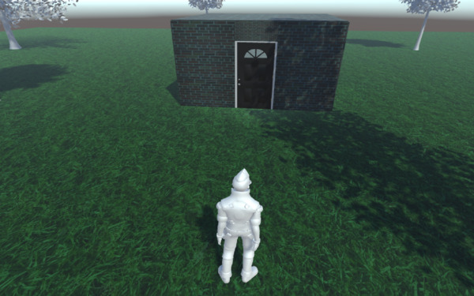
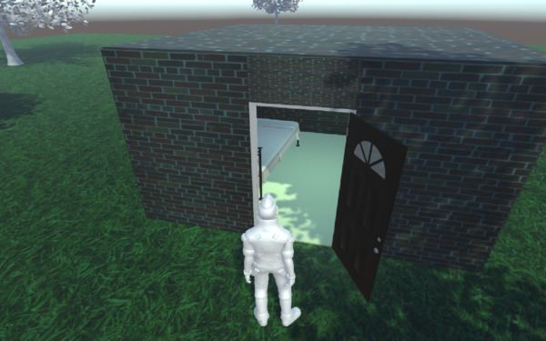
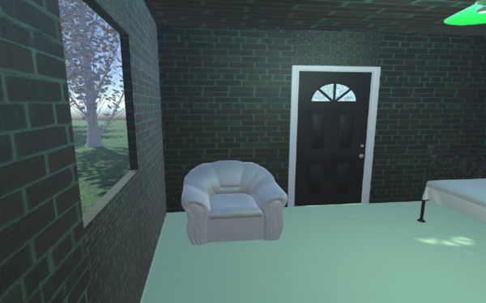

# demo-unity3d
Simple unity3d project. It demonstrates basics of working with scene, objects, materials, importing assets, and C# scripting.

Input controls unified for both PC and Android. In Android tap upper half for running, bottom half for walking.

# Screenshots

